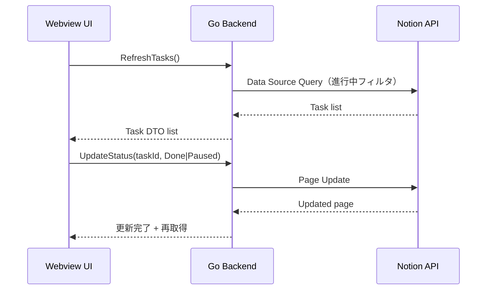

# 基本設計

## 画面・UX設計
- メニューバーアイコン（テンプレートアイコン推奨）
- 左クリックで小窓の表示/非表示をトグル
- 右クリックでメニュー表示（リフレッシュ/設定/終了）
- 小窓は「進行中タスクのみ」を表示し、Status は表示しない

### 操作導線
1. メニューバーアイコンクリック → 小窓表示
2. タスク横の「完了」「中断」を実行
3. 成功/失敗をトースト表示

## システム構成
- Go (Wails v3) バックエンド
- Wails Webview フロントエンド
- Notion API（REST）

Wails v3 の System Tray 機能とウィンドウ attach 機能を使い、メニューバー常駐と小窓トグルを実現する。

## データフロー

## 非機能要件
- パフォーマンス: 必要なプロパティのみ取得（title/url/last_edited_time 等）
- レート制限: 429 時は Retry-After を尊重しバックオフ
- オフライン: 最終取得結果を表示し「オフライン」表記
- セキュリティ: トークンは Keychain 優先、ログはマスク

## ローカル保存方針
- Keychain: Notion トークン
- 設定ファイル: `~/Library/Application Support/<AppName>/config.json`
  - database_id
  - data_source_id（初回取得後に保存）
  - status_property_name
  - status_in_progress / status_done / status_paused（更新/フィルタ用、UI非表示）
- キャッシュ: `~/Library/Caches/<AppName>/tasks.json`（任意）
- ログ: `~/Library/Logs/<AppName>/app.log`

## 更新戦略
- ポーリング間隔: 60 秒
- 手動リフレッシュあり
- 変更検知: last_edited_time で差分更新
- 更新直後は即時再取得

## ログ設計
- Level: ERROR/WARN/INFO/DEBUG
- トークンや個人情報はマスク

## エラー設計
- 401/403: 権限不足 → 設定画面誘導
- 404: DB/データソース未共有
- 429: バックオフ + Retry-After
- 5xx/timeout: リトライ + UI に警告

## 前提 / 仮定 / 未決事項
### 前提
- 対象 Database は 1 つ

### 仮定
- Status は UI には表示しないが、更新のために値は設定する

### 決定事項
- 中断タスクの「戻す」導線はメニューから「中断一覧」へ一時切替

## 参照すべき公式ドキュメント項目
- Wails v3: System Tray / Tray Menu / Window attach / Window options
- Notion API: Data Source model / Query a Data Source / Update Page / Versioning / Request limits
